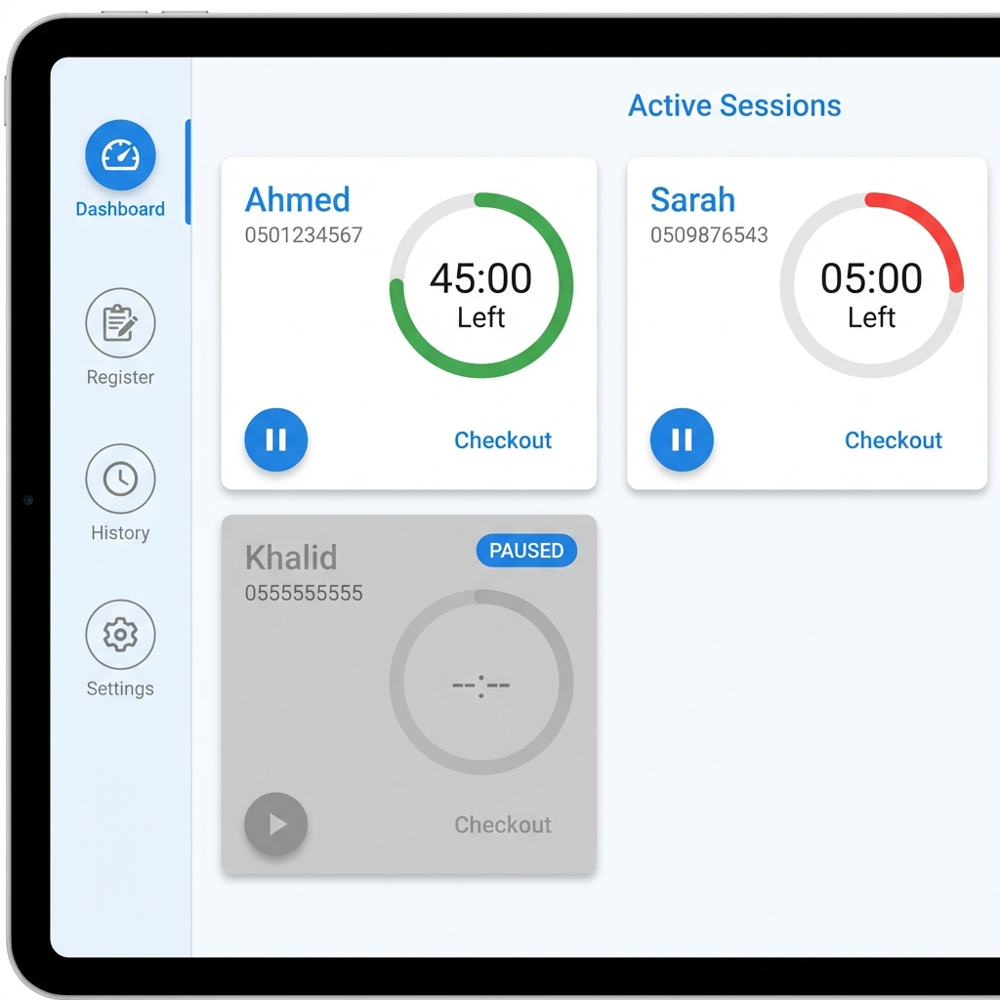
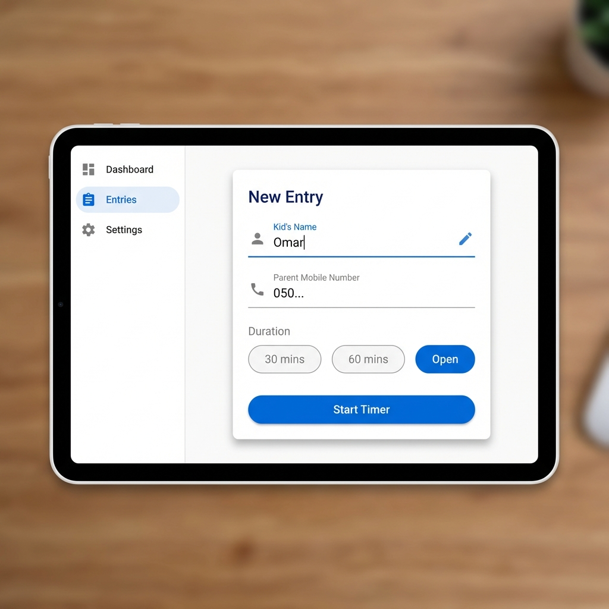
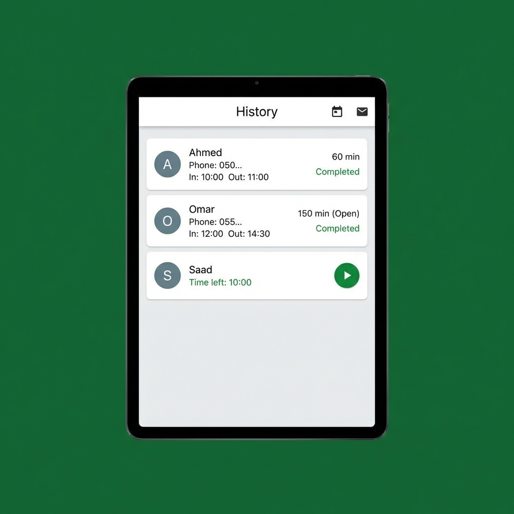
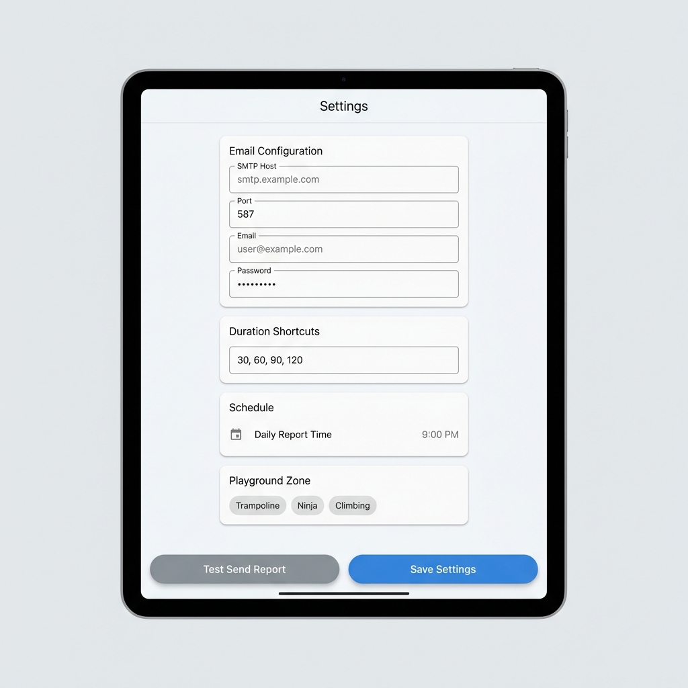

# تطبيق تتبع ساحة الألعاب - دليل المستخدم

## نظرة عامة
تطبيق تتبع ساحة الألعاب هو حل مخصص للأجهزة اللوحية لإدارة جلسات لعب الأطفال في منشأتك. يتيح لك التطبيق تسجيل الأطفال، تتبع وقت اللعب باستخدام مؤقتات آلية، عرض السجل، وإنشاء تقارير يومية عبر البريد الإلكتروني.

---

## 1. شاشة لوحة التحكم (Dashboard)
لوحة التحكم هي مركز القيادة الرئيسي. تمنحك نظرة فورية لجميع الأطفال النشطين حالياً في ساحة الألعاب.

### الميزات الرئيسية:
- **المؤقتات النشطة**: عرض الوقت المتبقي لكل طفل.
- **التنبيهات المرئية**:
  - **أخضر**: طبيعي (يوجد أكثر من 5 دقائق).
  - **برتقالي**: تحذير (أقل من 5 دقائق).
  - **أحمر**: انتهى الوقت (0 دقيقة).
- **إيقاف مؤقت/استئناف**: اضغط على أيقونة **الإيقاف المؤقت** لإيقاف المؤقت مؤقتاً (مثلاً لاستراحة دورة المياه). تتحول البطاقة للون الرمادي وتظهر الحالة "PAUSED". اضغط على **تغيل** للاستئناف.
- **تسجيل الخروج (Checkout)**: اضغط على **Checkout** عند مغادرة الطفل. سيتم نقل السجل إلى شاشة التاريخ (History).
- **التنبيهات**: عند انتهاء الوقت، يصدر صوت تنبيه ويظهر إشعار على الشاشة.

---

## 2. شاشة التسجيل (Register)
استخدم هذه الشاشة لتسجيل دخول أطفال جدد.

### الميزات الرئيسية:
- **اسم الطفل**: أدخل اسم الطفل.
- **رقم جوال الوالدين**: أدخل رقم الجوال (يجب أن يبدأ بـ 05 ويتكون من 10 أرقام).
- **المدة**: اختر مدة محددة مسبقاً (مثل 30، 60 دقيقة) أو اختر **مفتوح (Open)**.
  - **المدة المفتوحة**: تبدأ مؤقتاً تصاعدياً لحساب الوقت المنقضي، دون تنبيه لانتهاء الوقت.
- **بدء المؤقت (Start Timer)**: اضغط لإنشاء الجلسة والعودة إلى لوحة التحكم.

---

## 3. شاشة السجل (History)
عرض سجل لجميع الجلسات السابقة.

### الميزات الرئيسية:
- **تصفية حسب التاريخ**: اضغط على أيقونة التقويم لعرض السجل لتاريخ مختلف.
- **تفاصيل الجلسة**: عرض الاسم، رقم الهاتف، وقت الدخول ووقت الخروج.
- **المدة والحالة**:
  - **الجلسات المحددة**: تعرض الوقت المشترى (مثل "60 دقيقة"). الحالة تكون **مكتمل (Completed)** (إذا استنفذ الوقت بالكامل) أو **غير مكتمل (Incomplete)** (إذا غادر مبكراً).
  - **الجلسات المفتوحة**: تعرض الوقت المنقضي (مثل "150 دقيقة (Open)"). تكون دائماً معلمة كـ **مكتمل (Completed)** عند الخروج.
- **الاستئناف**: إذا غادر طفل مبكراً ثم عاد، استخدم زر **التشغيل** لإعادته إلى لوحة التحكم النشطة.
- **إرسال التقرير**: اضغط على أيقونة **البريد الإلكتروني** لإرسال تقرير CSV اليومي يدوياً للتاريخ المحدد.

---

## 4. شاشة الإعدادات (Settings)
تكوين التطبيق ليناسب احتياجاتك.

### الميزات الرئيسية:
- **تكوين البريد الإلكتروني**: إعداد تفاصيل خادم SMTP (مثل Gmail، Outlook) وباقي البيانات لتمكين التقارير اليومية.
- **اختصارات المدة**: تخصيص أزرار الوقت التي تظهر في شاشة التسجيل (مفصولة بفاصلة، مثل "30, 60, 90, 120").
- **الجدولة**: اختيار وقت إرسال التقرير اليومي الآلي (الافتراضي 9:00 مساءً).
- **منطقة اللعب**: اختيار المنطقة الافتراضية (ترامبولين، نينجا، إلخ) للتسجيلات الجديدة.
- **إرسال تجريبي**: التحقق من إعدادات البريد الإلكتروني عن طريق إرسال تقرير تجريبي فوراً.

---

## الدعم
لأي مشاكل تقنية، يرجى التواصل مع مسؤول النظام.
